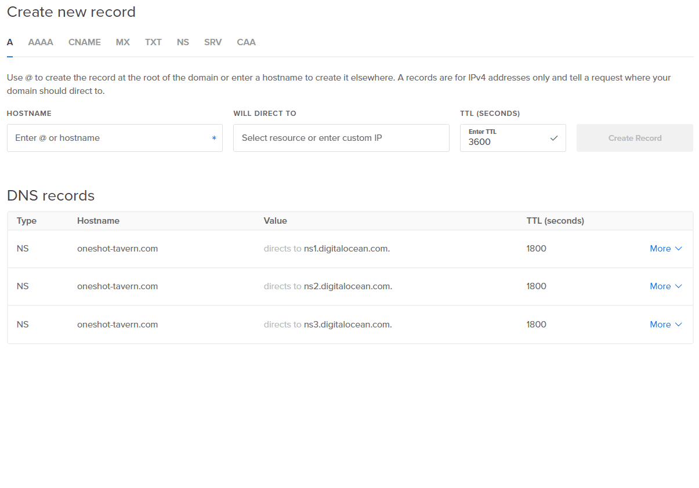
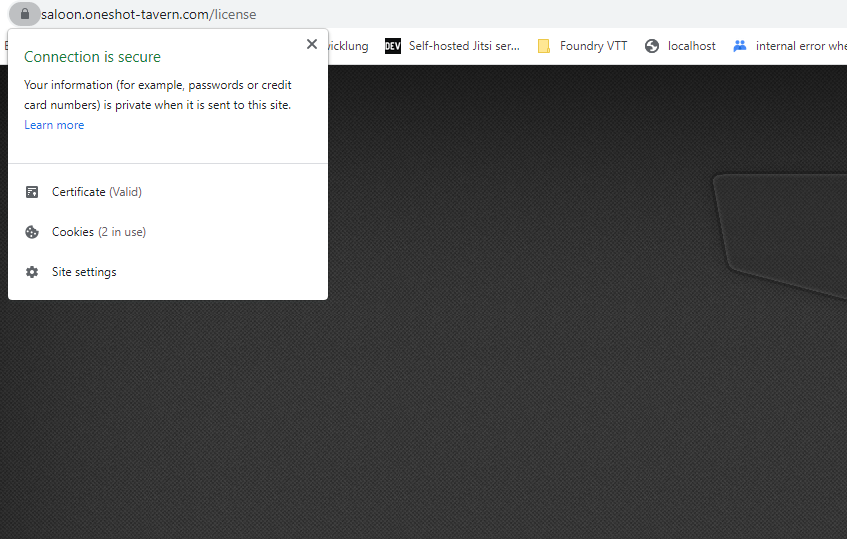

# Self-hosting Foundry VTT on Digital Ocean (Manual Installation)

If you want to have full control over your server, but do not want to self-host it at home (or can't), then this tutorial/guide is for you. Self-hosting on Digital Ocean is not free:

- A droplet (that's Digital Ocean's fancy name for a virtual machine, a server running in the cloud) starts at $5 per month
- Digital Ocean Spaces, which I would recommend using, adds another $5/month

For $10 ($11, if you want a little more _whoomp_ on your server) each month, you will get:

- an always on Foundry VTT server, with capabilities to run at least one, and possibly two additional Foundry VTT servers simultaneously
- 25GB disk storage within the droplet itself
- 250GB of additional storage on Digital Ocean Spaces, **with a free CDN** that you can enable.

---

# How to follow this tutorial

You can follow these steps by copy/pasting them one line at a time into a linux
shell. All lines that need copy/pasting into your shell window are surounded by such a box:

```
echo "This is a command run in your linux shell"
```

If you are seeing some pound signs `#` in these code blocks, then regard those as additional commentary. Do not copy/paste them:

```
# This is a comment that explains the command below
# Here, we are displaying "Hello" to the console
echo "Hello World"
```

## How to copy/paste

Console shells are normally very easy to use:

- **Copying**: Select text with your mouse and right-click in the shell window to copy the selected text.
- **Pasting**: When nothing is selected in your shell, right-click somewhere and the contents of your clipboard will be pasted on the cursor location

# Applications used

- node.js: To actually run Foundry VTT, which is a Javascript application/webserver
  node.js is an environment to run JavaScript apps on a server
- pm2: Process Manager 2 - let you run a JavaScript application continuously
  It has a nice, little management user interface where you can see
  performance data and start/stop/restart commands plus a log viewer
- caddy: A tiny little webserver and reverse proxy. This will create and refresh
  SSL certificates for Foundry to make everyone happy and is very easy to
  configure, even manually

I want to create an **easy way to self-host**, therefore I decided against using popular tools like Docker. They are popular for a reason, but I want you to understand what you are doing. Explaining containers to technically less-inclined (and probably less tech-interested, too!) audience is not the scope of this tutorial. Get shit done, understand how it works, and why, be happy.

# Digital Ocean

I am using DO for years now, and I am sticking around because

a) it's very easy to use
b) it's reliable
c) it is reasonably cheap. Yes, Amazon AWS, Google, Azure, they all cost a little

less, but are (imho) way more complicated to use. I want to get shit done, not
learn to use a cloud provider's management utilities. Your mileage may vary.

## Referral Key

If you sign up using this link: [https://m.do.co/c/ea9292afc8cc](https://m.do.co/c/ea9292afc8cc)
you get $100 to play around Digital Ocean, those credits will expire 60 days after sign-up. If you like Do and stay, and pay your bills, and accumulate $25 in total of real, hard-earned cash, I will get $25 deducted from my DO bill.

Currently, driving VTTA costs around $300/month, so every bit helps. If you want to sign-up without a referral code, go here: https://www.digitalocean.com.

# Prerequisites

- This installation instructions starts AFTER you signed-up at DO and after you created your droplet. It assumes that you have a linux shell blinking at you. Please follow my video tutorial for more instructions on how to get there.
- You need to register a domain to Digital Ocean and
- You will need to decide on your domain/subdomain where you want to access the server later on. That could be e.g. table.myfoundrygames.com, or myweirdplace.com, or, as in my example: saloon.oneshot-tavern.com.

  I will be using that as an example in this toturioal, simple replace **saloon.oneshot-tavern.com** with the domain name of your choosing. To make it easier to follow, there is # one single place in this totorial where you need to replace the domain saloon.oneshot-tavern.com with your own domain and every other command # will adjust automatically.

  In Digital Ocean's Control Panel, head to **Networking > [Domains](https://cloud.digitalocean.com/networking/domains)**. I configured my domain as pictured:

  

  - A **A-record** for the hostname **@** pointing to my droplet's IP address
  - Three **CNAME-records** for the hostnames **saloon**, **www** and **discord** respectively, pointing to the hostname **@**

  The **@-symbol** is an alias to the domain name, in my example: **oneshot-tavern.com**.

## STEP ONE: Updating the system

It's a good idea to update the operating system, even if we just created the droplet. The folliowing command will update your package list (checking: What's new) and then actually processing all available updates The `&&` is used to concatenate commands, because Linux guys are super cool.

```
apt update && apt upgrade -y
```

## STEP TWO: Securing the Server (the basics)

Add a new user named 'crucible'. Set the prompted details to your liking and remember the password you are configuring

```
adduser crucible
```

Now we are adding this user to the sudoers grup

```
usermod -aG sudo crucible
```

Let's copy our public key that Digital Ocean inserted for the root account into the home directory of the crucible user. We will create the required directory first

```
# Switch (`su` = switch user) to the crucible user
su crucible # Enter the crucible user's password

# Create the .ssh directory within your user's home directory
mkdir ~/.ssh # Create the SSH directory

# Now let's go back to root's session by existing crucial's session
exit
```

With the directory in place, we copy the saved public key from root's home directory to crucible's home directory and we will transfer ownership (`chown` = change owner) to the crucible user

```
cp ~/.ssh/authorized_keys /home/crucible/.ssh && chown crucible:crubible /home/crucible/.ssh/authorized_keys
```

You can now test to authenticate with the `crucible` user using SSH and your private key. If it works fine, you should configure the ssh server to prohibit logging in with the root user directly. In the future, we will login with the user `crucible` and use `sudo` (**s**uper **u**ser **do**) if we need to do something requiring administrational access.

**Go on after successfully logging in with the `crucible` user**. If you cannot login, check the instructions above, then try again.

### The following commands are executed by the user `crucible`

```
sudo nano /etc/ssh/sshd_config
```

Change these following configurations:

1. Disable direct root login to the server, as we log onto the server as the `crucible` user from now on. Change the line:

   ```
   PermitRootLogin yes
   ```

   to

   ```
   PermitRootLogin no
   ```

2. Uncomment this setting to enable public key authentication, change the line

   ```
   # PubkeyAuthentication yes
   ```

   to

   ```
   PubkeyAuthentication yes
   ```

Save your changes with `CTRL-O`, then exit the editor with `CTRL-X` and restart the sshd service:

```
sudo service sshd restart
```

### Install and configure a firewall: `ufw`

As a last measure we will install an application firewall that will enable only three ports: The SSH port, and ports 80/443 for traffic to our
webserver. Port 80 is required for obtaining SSL certificates, we will use the encrypted SSL connection to actually play on Foundry later on

```
# Install the firewall
sudo apt install ufw

# Per default: Deny every connection attempt from the world INTO the server
sudo ufw default deny incoming
# but if we are requesting outside resources FROM our server, it's okay
sudo ufw default allow outgoing

# We want to access the server with SSH (TCP port 22), HTTP (tcp port 80) and HTTPS (tcp port 443):
sudo ufw allow 22/tcp
sudo ufw allow 80/tcp
sudo ufw allow 443/tcp

# That's it. Let's enable the firewall and check it
# If prompted: Confirm that the current shh connection might get interrupted (it won't, probably)
sudo ufw enable

# Let's show a list of ports that are configured, should be all good!
sudo ufw status numbered
```

There is probably a couple of things that you can do additionally, but that will give you a very viable server to work with! Congrats!

## STEP THREE: Adding installation sources

Not everything is availalbe from the official debian package repositories. Debian is especially conservative in regards to allowing additional packages
into their repositories and has the mentality "stability over newest features", therefore the most recent version's of a software are sometimes unavailable.

This is true for node.js and caddy, so let's add those repositories into our system. The commands to add them are provided by node.js and caddy. You can install
both components by hand, but I am a trusting guy (and they are projects with a great reputation)

```
# node.js
curl -fsSL https://deb.nodesource.com/setup_lts.x | bash -
curl -fsSL https://deb.nodesource.com/setup_lts.x | sudo bash -

# and caddy
curl -1sLf 'https://dl.cloudsmith.io/public/caddy/stable/gpg.key' \
   | sudo tee /etc/apt/trusted.gpg.d/caddy-stable.asc
curl -1sLf 'https://dl.cloudsmith.io/public/caddy/stable/debian.deb.txt' \
   | sudo tee /etc/apt/sources.list.d/caddy-stable.list

# Let's update again because it's so much fun
sudo apt update && sudo apt upgrade -y
```

## STEP FOUR: Installing Prerequisites for the components

```
# node.js and caddy require some other packages to be installed. Let's do this
sudo apt install -y debian-keyring debian-archive-keyring apt-transport-https

# some additional utilities that might you find handy later on. Unzip will
# be needed later to, well unzip the Foundry release archive
sudo apt install -y yarn git unzip
```

## STEP FIVE: Installing the components

Finally install the components I will add yarn (it's node-related) and git (it's generally useful), too.

```
# node.js installation
sudo apt install -y nodejs

# caddy installation
sudo apt-get install -y caddy

# pm2 installation (plus a log rotate tool that will help is to NOT fill up our
# hard disk with # log files
sudo npm install pm2@latest -g
sudo pm2 install pm2-logrotate

# We want pm2 to start automcatically on boot. We will later save a desired set of
# applications (our Foundry VTT server(s)) that will startup then, too
sudo pm2 startup
```

## STEP SIX: Installing the components

Let's show all directories that will be used later to configure the system

**Caddy configuration files:** `/etc/caddy` (exists already)

Let's decice where we will store our servers later. To make the commands shown below
be a little bit dynamic, we will export this as an environment variable: CRUCIBLE_HOME
Change the '/var/crucible' path with a path you would like to use, keeping it somewhere in `/var`
is a good idea though while using a user's home directory (e.g. `/home/crucible/servers`)
is not a good choice.

```
# Save the environment variable $CRUCIBLE_HOME in our user's profile, it
# will then be available even after a reboot
echo "export CRUCIBLE_HOME=/var/crucible" > ~/.profile && source .profile

# Now we can use the variable `$CRUCIBLE_HOME` in our commands
# The '-p' stands for "If it does not exist already")

sudo mkdir -p $CRUCIBLE_HOME
```

## STEP SEVEN: Get the Foundry VTT release

Let's grab the Foundry binary from http://foundryvtt.com. Login, go to your profile and to the **Purchased Licenses**. Leave that tab open for copy/pasting the license later on

Under "Download Foundry Virtual Tabletop Software" select:

- Download Version: Whatever
- Operating System: Linux/NodeJS, like a real hacker
- click the "Timed URL" button, you have a link that is valid for a couple of minutes in your clipboard

Head over to your linux shell and create a command that looks like this:

```
sudo curl '[INSERT COPIED LINK HERE]' --output $CRUCIBLE_HOME/fvtt.zip
```

With real life data, it will look like this:

```
sudo curl 'https://foundryvtt.s3.amazonaws.com/releases/[RELEASE]/foundryvtt-[VERSION]?AWSAccessKeyId=[SOME_WEIRD_CHARACTERS]&Signature=[MORE_WEIRDNESS]&Expires=[NUMBERS!]' --output $CRUCIBLE_HOME/fvtt.zip
```

If you want to organize your downloads, you can use the `--output` parameter to specifiy a more meaningful the filename, e.g. `--output $CRUCIBLE_HOME/foundry-0.8.9.zip`. This helps you to build a tiny library of your most-loved releases.

## STEP EIGHT: Prepare the Foundry installation

Let's create a directory that will contain EVERYTHING related to this server. I always use the domain / subdomain as a directory, that resonates pretty well
with my memory: _"Ah, that's the directory for my server saloon.oneshot-tavern.com, I need to change a tiny bit in it's config"_.

To save on typing, I will save the domain name in a environment variable, but this time I will not save it into my profile. It is just used during installation
and not later on:

```
export DOMAIN=saloon.oneshot-tavern.com
```

then I can use this new variable in a command to create the following directory structure:

```
sudo mkdir -p $CRUCIBLE_HOME/servers && sudo mkdir -p $CRUCIBLE_HOME/servers/$DOMAIN && sudo mkdir -p $CRUCIBLE_HOME/servers/$DOMAIN/bin && sudo mkdir -p $CRUCIBLE_HOME/servers/$DOMAIN/data && sudo mkdir -p $CRUCIBLE_HOME/servers/$DOMAIN/data/Config && sudo mkdir -p $CRUCIBLE_HOME/servers/$DOMAIN/logs
```

rsults in

```
/var/crucible
/var/crucible/servers
/var/crucible/servers/saloon.oneshot-tavern.com
/var/crucible/servers/saloon.oneshot-tavern.com/bin # The Foundry application will reside here. The "core path"
/var/crucible/servers/saloon.oneshot-tavern.com/data # This will be your "user data" directory
/var/crucible/servers/saloon.oneshot-tavern.com/data/Config # Foundry stores it's configuration here
/var/crucible/servers/saloon.oneshot-tavern.com/logs # PM2 will store it's logs heree
```

Lets unzip the downloaded foundry.zip into the /bin directory. **Remember to replace the 'fvtt.zip' with the filename you choose in STEP SEVEN!**

```
sudo unzip $CRUCIBLE_HOME/fvtt.zip -d $CRUCIBLE_HOME/servers/$DOMAIN/bin
```

pm2 can be configured in many ways, by providing command line arguments, by a configuration option file for a service or by using an API. If you want to get a quick understanding about

- **how** something is configured
- **understand** the configuration and
- **change** the configuration easily a couple of months are originally creating a service

a configuration options file is the way to go. A sample file looks like that:

```
module.exports = {
   apps : [{
      name : "saloon.oneshot-tavern.com",
      cwd: "/var/crucible/servers/saloon.oneshot-tavern.com/bin",
      script: "resources/app/main.js",
      args: [
         "--dataPath=/var/crucible/servers/saloon.oneshot-tavern.com/data",
         "--port=30000",
         "--hostname=saloon.oneshot-tavern.com",
         "--proxySSL=true",
         "--proxyPort=443"
      ],
      error_file: "/var/crucible/servers/saloon.oneshot-tavern.com/logs/error.log",
      out_file: "/var/crucible/servers/saloon.oneshot-tavern.com/logs/out.log",
  }]
}

```

It basically says: **Let's create an application** that

- I want to call "saloon.oneshot-tavern.com"...
- ...it is run from the current working directory (cwd) /var/crucible/servers/saloon.oneshot-tavern.com/bin ...
- ...so to there and start the script "resources/app/main.js".
- Please start it with the following arguments (args)

If you ever ran Foundry VTT from the command line, you might remember some of the entries in `args`. Let's script creating the configuration options file, because who likes typing? We like copy/pasting like real programmers do!

- We insert all configured environment variables into the first line
- write that to disk (tee)
- and beautify the output so we can understand it a bit easier when looking

```
echo "module.exports={apps : [{name:\"$DOMAIN\",cwd:\"$CRUCIBLE_HOME/servers/$DOMAIN/bin\",script: \"resources/app/main.js\",args:[\"--dataPath=$CRUCIBLE_HOME/servers/$DOMAIN/data\",\"--port=30000\",\"--hostname=$DOMAIN\",\"--proxySSL=true\",\"--proxyPort=443\"],\"out_file\":\"$CRUCIBLE_HOME/servers/$DOMAIN/logs/out.log\",\"error_file\":\"$CRUCIBLE_HOME/servers/$DOMAIN/logs/error.log\"}]}" \
 | sudo tee $CRUCIBLE_HOME/servers/$DOMAIN/ecosystem.config.js \
 && sudo npx prettier --single-quote --write --trailing-comma all $CRUCIBLE_HOME/servers/$DOMAIN/ecosystem.config.js
```

Inspect the generated file to see if there are any errors:

```
cat $CRUCIBLE_HOME/servers/$DOMAIN/ecosystem.config.js
```

Note the `--port=30000` part: We will let Foundry run on **Port 30000**, if you plan to run other servers in parallel to the first you will need to count that number up for every server. Or use: 30000, 31000, 32000 - as long as they all different from each other (and to other ports already in use on your server), you are good. **You just need to remember this.**

Foundry could use some help with other settings. We can provide them in a configuration file that resides in your user data directory. This is an example for such an option file:

```
{
  port: 30000,
  upnp: true,
  fullscreen: false,
  hostname: "saloon.oneshot-tavern.com",
  localHostname: null,
  routePrefix: null,
  sslCert: null,
  sslKey: null,
  awsConfig: null,
  dataPath: /var/crucible/servers/saloon.oneshot-tavern.com/data,
  proxySSL: true,
  proxyPort: 443,
  minifyStaticFiles: false,
  updateChannel: "stable",
  language: "en.core",
  upnpLeaseDuration: null,
  world: null,
};

```

# Some of the options can be supplied as command line arguments when starting the server, so we will not provide them twice. The entries for 'port', 'hostname' and 'dataPath' will therefore be removed from our options file.

## OPTIONAL: Use Digital Ocean Spaces

I f you want to use Digital Ocean Spaces with Foundry VTT, you will need to create an additional options file containing credentials authorized to read from and write to Digital Ocean Spaces

Go to the **Digital Ocean Control Panel** > **API** > \*\*[Tokens](https://cloud.digitalocean.com/account/api/tokens) and scroll down to "Spaces access keys". Generate a new key using the grey button on the right. You will be able to name the key pair that will be generated, that helps you to remember which key to delete in case you want to clean up your personal token mess at one day in the future.

After naming your key pair, you will see two randomized strings:

- the top one is your **Access Key**
- the one below is your **Secret Key**

The third parameter is the region your Spaces storage resides in. Choose one near you and your droplet for best performance. At the time of writing, Digital Ocean provides Spaces in

- San Fransisco: Region `sfo3`
- Frankfurt: Region `fra1`
- Amsterdam: Region `ams3`
- New York: Region `nyc3`
- Singapore: Region `sgp1`

Choose, e.g. `fra1` for Spaces located in Frankfurt, Germany

Run the following commands, replacing the appropriate bracketed values with your real keys:

```
export SPACES_ACCESS_KEY=[YOUR COPIED ACCESS KEY]
export SPACES_SECRET_KEY=[YOUR COPIED SECRET KEY]
export SPACES_REGION=[YOUR CHOOSEN REGION]
```

It might for example look like this:

```
export SPACES_ACCESS_KEY=thisisnotmyrealkey
export SPACES_SECRET_KEY=butitshowsyouhowitmightlooklike
export SPACES_REGION=fra1
```

Then create the Spaces configuration file by running

```
echo "{\"accessKeyId\":\"$SPACES_ACCESS_KEY\",\"secretAccessKey\":\"$SPACES_SECRET_KEY\",\"region\":\"$SPACES_REGION\"}" \
 | sudo tee $CRUCIBLE_HOME/servers/$DOMAIN/data/Config/spaces.config.json \
 && sudo npx prettier --single-quote --write --trailing-comma all $CRUCIBLE_HOME/servers/$DOMAIN/data/Config/spaces.config.json
```

## END OF OPTIONAL: Use Digital Ocean Spaces

### If you do not want to use spaces, run:

```
echo "{\"upnp\":true,\"fullscreen\":false,\"localHostname\":null,\"routePrefix\":null,\"sslCert\":null,\"sslKey\":null,\"awsConfig\":null,\"minifyStaticFiles\":false,\"updateChannel\":\"stable\",\"language\":\"en.core\",\"upnpLeaseDuration\":null,\"world\":null}" \
| sudo tee $CRUCIBLE_HOME/servers/$DOMAIN/data/Config/options.json \
 && sudo npx prettier --single-quote --write --trailing-comma all $CRUCIBLE_HOME/servers/$DOMAIN/data/Config/options.json
```

### If you want to use spaces and followed the optional instructions above, run:

```
echo "{\"upnp\":true,\"fullscreen\":false,\"localHostname\":null,\"routePrefix\":null,\"sslCert\":null,\"sslKey\":null,\"awsConfig\":\"spaces.config.json\",\"minifyStaticFiles\":false,\"updateChannel\":\"stable\",\"language\":\"en.core\",\"upnpLeaseDuration\":null,\"world\":null}" \
| sudo tee $CRUCIBLE_HOME/servers/$DOMAIN/data/Config/options.json \
 && sudo npx prettier --single-quote --write --trailing-comma all $CRUCIBLE_HOME/servers/$DOMAIN/data/Config/options.json
```

Let's run Foundry for the first time to see if all of our configurations work flawlessly. Start the server manually, replicating the arguments of the pm2 ecosystem file, in short: Go into the `/bin` directory of the server, run the main script and append all relevant command line arguments:

```
cd $CRUCIBLE_HOME/servers/$DOMAIN/bin && bash -c "sudo node resources/app/main.js --dataPath=$CRUCIBLE_HOME/servers/$DOMAIN/data --port=30000 --hostname=$DOMAIN --proxySSL=true --proxyPort=443"
```

If everything is okay, you should see the output of your config file, changed by all the command line parameters. The only warning should be the one stating that the license requires validation: `"FoundryVTT | 2021-10-15 17:42:29 | [warn] Software license requires signature."`

Stop the server with `CTRL-C` is everything is okay, otherwise try to follow up on the tutorial and repeat any step that you might have got wrong.

## STEP NINE: Registering the process within pm2

With the server running with the supplied arguments perfectly fine, we can register that config with pm2. pm2 will then start the server for us, allows us to monitor it easily and start the server automatically on boot

Since we already create the relevant pm2 ecosystems file, we can register it by simply running

```
cd $CRUCIBLE_HOME/servers/$DOMAIN && sudo pm2 start
```

To automatically start this Foundry server on boot we need to save the current process list. pm2 will then start all currently running processes:

```
sudo pm2 save
```

# Hurrray! We got a running server, let's access it!

Go to http://saloon.oneshot-tavern.com and... duh. Something happens, but it's not a Foundry server displaying, it's the greetings page from Caddy, the webserver we installed. Foundry cannot be reached, because if you remember:

- Foundry is running on Port 30000
- We configured the application firewall ufw to only allow port 80, 443 and 22 INTO the server
- On port 80, the unencrypted connection via HTTP, Caddy responds due to it's default configuration.

Let's change that in our last step

## STEP TEN: Adjusting Caddy

Caddy has a configuration file stored in `/etc/caddy/Caddyfile`. If we look at this, we can quickly see how easy it is to read, even if you don't know
anything about Caddy at all:

```

:80 { # Set this path to your site's directory.
   root \* /usr/share/caddy

   # Enable the static file server.
   file_server

   # Another common task is to set up a reverse proxy:
   # reverse_proxy localhost:8080

   # Or serve a PHP site through php-fpm:
   # php_fastcgi localhost:9000
}

```

The configuration is very short.

- Listen to all network interfaces on port 80, and if a request comes in
- Use the folder /usr/share/caddy as a root directory

If we inspect the referenced directory

```
ls /usr/share/caddy
```

we can see a single file names `index.html`: This will be displayed to the user. Understood!

Let's think about what we want to achieve:

- If I go to "https://saloon.oneshot-tavern.com", my Foundry server should pop up
- The connection should be secured by SSL
- Everything else, like a webserver to display additional information to my players can wait
- We might create a second Foundry VTT server down the line, so let's adjust the config to make it easily extensible

```
sudo mkdir -p /etc/caddy/crucible && echo "import /etc/caddy/crucible/\*" | sudo tee /etc/caddy/Caddyfile
```

This creates a directory `/etc/caddy/crucible` where we will save one configuration file per Foundry VTT server. Caddy will load all found files automatically, so that works for us super fine! And a working caddy configuration serving our needs looks as simple as:

```
saloon.oneshot-tavern.com {
    reverse_proxy localhost:30000
}
```

Now let's create a config with our desired domain:

```
echo -e "saloon.oneshot-tavern.com {\n\treverse_proxy localhost:30000\n}" | sudo tee /etc/caddy/crucible/oneshot-tavern.com.config

# Caddy needs a restart after you changed the configuration:
sudo service caddy restart
```

If you check https://saloon.oneshot-tavern.com you will be greeted with the Foundry VTT license screen. **You made it!**


## Bonus: Re-create the webserver

**Please remember**: I created a DNS record to point `oneshot-tavern.com` **and** `www.oneshot-tavern.com` to the Droplet's IP address. If you want to follow this last bonus part, you will need to configure those records, too.

Let's create a simple configuration that will serve HTML files from `/var/www` (which is more easy to remember for me than `/usr/share/caddy`, which was the default greeting's page right after installation of Caddy.

Configuring Caddy to present the user the website if the user entered `oneshot-tavern.com` or `www.oneshot-tavern.com` is very easy. Create a configuration file containing the following content and store it at `/etc/caddy/www.conf`:

```
# www will be redirected to non-www
www.oneshot-tavern.com {
  redir https://oneshot-tavern.com/{uri}
}

oneshot-tavern.com {
  root * /var/www
  file_server
}
```

To load this additional configuration, add the following line to your `/etc/caddy/Caddyfile` configuration:

```
import /etc/caddy/www.conf
```

Trigger a reload of Caddy's running configuration::

```
sudo service caddy reload
```

## Bonus: Create an easy-to-remember Discord invite link

**Please remember**: I created a DNS record to point `discord.oneshot-tavern.com` to the Droplet's IP address. If you want to follow this last bonus part, you will need to configure those records, too.

Generate an invite link that never expires using Discord's utility. Then create a redirection quite similar to the one used above and store it at `/etc/caddy/discord.conf`:

```
# redirect discord.oneshot-tavern.com to the Discord invite link
discord.oneshot-tavern.com {
  redir https://discord.gg/5HAJ9SKxJk
}
```

To load this additional configuration, add the following line to your `/etc/caddy/Caddyfile` configuration:

```
import /etc/caddy/discord.conf
```

Trigger a reload of Caddy's running configuration::

```
sudo service caddy reload
```
